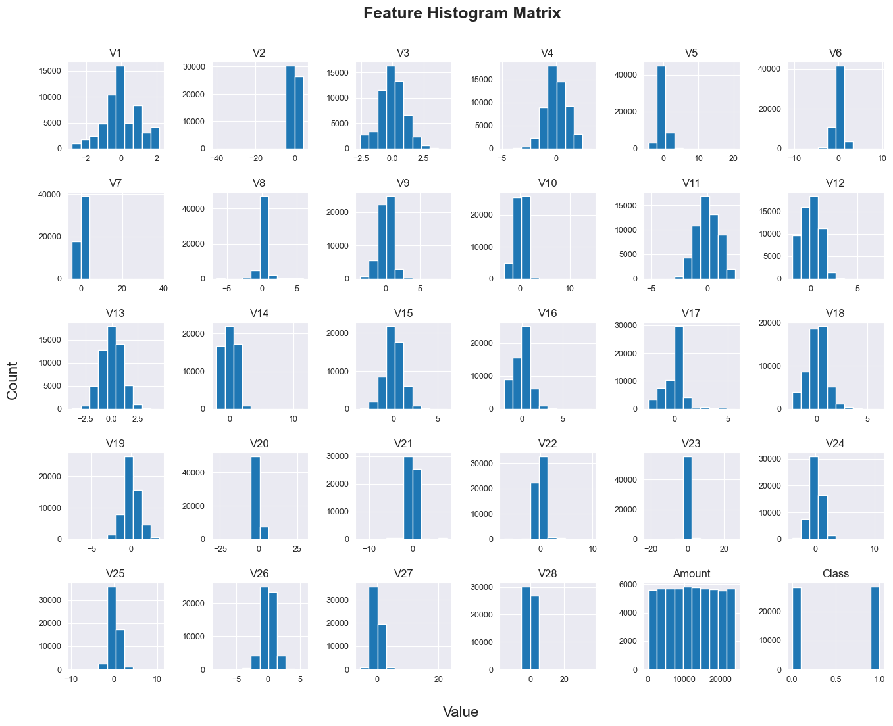
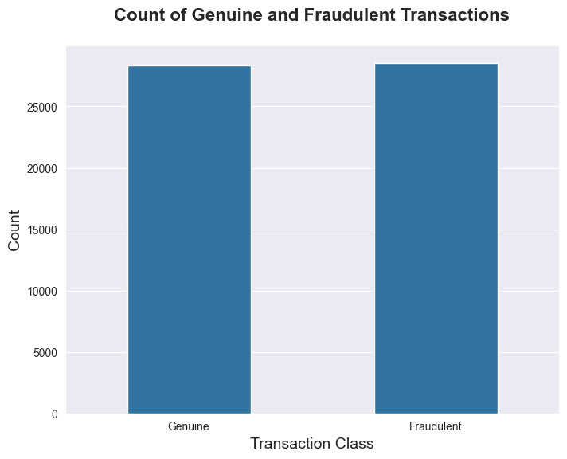

##### Wednesday the 11th of September, 2024
# Performance Comparison of Machine Learning Classification Models for Credit Card Fraud Detection

---

## Introduction
### Background

Among the largest expenses for credit card issuers are investments in fraud detection and prevention measures, due to the ever-evolving nature of credit card fraud. Nonetheless, the high costs are necessary to reduce financial losses, protect customer trust, and maintain security and regulatory compliance. One way such companies may reduce fraud-related expenses and improve customer trust is by detecting fraudulent transactions as early as possible, ideally in real-time. 
 
Employing machine learning to address this problem could reduce operational costs by automating fraud prevention, and preventing the escalation of fraud patterns, ultimately ensuring a more secure and efficient system.

### Objective

The goal of this project is to develop a machine learning classification model to predict whether credit card transactions are fraudulent, based on a number of transaction attributes. We will train and compare various machine learning classification models to determine which is optimal for credit card fraud detection. The model types to be compared are Logistic Regression, K Nearest Neighbours, Support Vector Machines, Decision Tree, and Random Forest.

----
## Dataset description
The [Credit Card Fraud Detection](https://www.kaggle.com/datasets/nelgiriyewithana/credit-card-fraud-detection-dataset-2023) dataset used in this project contains credit card transaction records for European customers in 2023. It comprises over 550,000 records and 28 transaction attributes (e.g., transaction type, merchant name, location, time) rendered anonymous by principal component analysis (PCA) transformation. Each transaction is labeled as either fraudulent (1) or non-fraudulent (0), which facilitates the training and evaluation of fraud detection systems.

The data source is not disclosed to protect cardholder privacy and confidentiality.

---
## Import Python Modules

First, we import the libraries/modules that will be used in this project:

- pandas
- numpy
- matplotlib
- seaborn
- Scikit-learn

---
## Load the Data

Let's start by loading the dataset `creditcard_2023.csv` into a dataframe and previewing the first 5 rows of data.

<table border="1" class="dataframe">
  <thead>
    <tr style="text-align: right;">
      <th></th>
      <th>id</th>
      <th>V1</th>
      <th>V2</th>
      <th>V3</th>
      <th>V4</th>
      <th>V5</th>
      <th>V6</th>
      <th>V7</th>
      <th>V8</th>
      <th>V9</th>
      <th>...</th>
      <th>V21</th>
      <th>V22</th>
      <th>V23</th>
      <th>V24</th>
      <th>V25</th>
      <th>V26</th>
      <th>V27</th>
      <th>V28</th>
      <th>Amount</th>
      <th>Class</th>
    </tr>
  </thead>
  <tbody>
    <tr>
      <th>0</th>
      <td>0</td>
      <td>-0.260648</td>
      <td>-0.469648</td>
      <td>2.496266</td>
      <td>-0.083724</td>
      <td>0.129681</td>
      <td>0.732898</td>
      <td>0.519014</td>
      <td>-0.130006</td>
      <td>0.727159</td>
      <td>...</td>
      <td>-0.110552</td>
      <td>0.217606</td>
      <td>-0.134794</td>
      <td>0.165959</td>
      <td>0.126280</td>
      <td>-0.434824</td>
      <td>-0.081230</td>
      <td>-0.151045</td>
      <td>17982.10</td>
      <td>0</td>
    </tr>
    <tr>
      <th>1</th>
      <td>1</td>
      <td>0.985100</td>
      <td>-0.356045</td>
      <td>0.558056</td>
      <td>-0.429654</td>
      <td>0.277140</td>
      <td>0.428605</td>
      <td>0.406466</td>
      <td>-0.133118</td>
      <td>0.347452</td>
      <td>...</td>
      <td>-0.194936</td>
      <td>-0.605761</td>
      <td>0.079469</td>
      <td>-0.577395</td>
      <td>0.190090</td>
      <td>0.296503</td>
      <td>-0.248052</td>
      <td>-0.064512</td>
      <td>6531.37</td>
      <td>0</td>
    </tr>
    <tr>
      <th>2</th>
      <td>2</td>
      <td>-0.260272</td>
      <td>-0.949385</td>
      <td>1.728538</td>
      <td>-0.457986</td>
      <td>0.074062</td>
      <td>1.419481</td>
      <td>0.743511</td>
      <td>-0.095576</td>
      <td>-0.261297</td>
      <td>...</td>
      <td>-0.005020</td>
      <td>0.702906</td>
      <td>0.945045</td>
      <td>-1.154666</td>
      <td>-0.605564</td>
      <td>-0.312895</td>
      <td>-0.300258</td>
      <td>-0.244718</td>
      <td>2513.54</td>
      <td>0</td>
    </tr>
    <tr>
      <th>3</th>
      <td>3</td>
      <td>-0.152152</td>
      <td>-0.508959</td>
      <td>1.746840</td>
      <td>-1.090178</td>
      <td>0.249486</td>
      <td>1.143312</td>
      <td>0.518269</td>
      <td>-0.065130</td>
      <td>-0.205698</td>
      <td>...</td>
      <td>-0.146927</td>
      <td>-0.038212</td>
      <td>-0.214048</td>
      <td>-1.893131</td>
      <td>1.003963</td>
      <td>-0.515950</td>
      <td>-0.165316</td>
      <td>0.048424</td>
      <td>5384.44</td>
      <td>0</td>
    </tr>
    <tr>
      <th>4</th>
      <td>4</td>
      <td>-0.206820</td>
      <td>-0.165280</td>
      <td>1.527053</td>
      <td>-0.448293</td>
      <td>0.106125</td>
      <td>0.530549</td>
      <td>0.658849</td>
      <td>-0.212660</td>
      <td>1.049921</td>
      <td>...</td>
      <td>-0.106984</td>
      <td>0.729727</td>
      <td>-0.161666</td>
      <td>0.312561</td>
      <td>-0.414116</td>
      <td>1.071126</td>
      <td>0.023712</td>
      <td>0.419117</td>
      <td>14278.97</td>
      <td>0</td>
    </tr>
  </tbody>
</table>

5 rows × 31 columns

---
## Exploratory Data Analysis

### Distributions of Features
To visualize the distribution of each feature, we plot a histogram matrix as we have only numeric features
#### Plotting Histogram Matrix
    

    

### Distribution of Target
To get an idea of the distribution of the target variable, we first use the `value_counts()` method to return the count of each category. To visualize the distribution, we plot a countplot, which shows the count of both genuine and fraudulent transactions in the dataset.

#### Plotting the Target Distribution

    

    

As evident in the above plot, the target variable is balanced with 284,315 genuine transactions and 284,315 fraudulent transactions.

---
## Model Development

### Logistic Regression Model

    Mean Logistic Regression Cross-Validation Scores:

    fit_time       0.043551
    score_time     0.001902
    test_score     0.965861
    train_score    0.966273
    dtype: float64

### Linear Support Vector Classification Model

    Mean Linear SVC Cross-Validation Scores:
    
    fit_time       0.062159
    score_time     0.001914
    test_score     0.958101
    train_score    0.958090
    dtype: float64

### Random Forest Model

    Mean Random Forest Cross-Validation Scores:

    fit_time       5.635853
    score_time     0.018312
    test_score     0.983865
    train_score    0.988168
    dtype: float64

## Preliminary Score Comparison

Below, we compare the training scores for the three models trained in the previous section

<table border="1" class="dataframe">
  <thead>
    <tr style="text-align: right;">
      <th></th>
      <th>Model</th>
      <th>Training Score</th>
      <th>Test Score</th>
    </tr>
  </thead>
  <tbody>
    <tr>
      <th>0</th>
      <td>Logistic Regression</td>
      <td>0.966273</td>
      <td>0.965861</td>
    </tr>
    <tr>
      <th>1</th>
      <td>Linear SVC</td>
      <td>0.958090</td>
      <td>0.958101</td>
    </tr>
    <tr>
      <th>2</th>
      <td>Random Forest</td>
      <td>0.988168</td>
      <td>0.983865</td>
    </tr>
  </tbody>
</table>

## Discussion

In terms of training score, the ***Random Forest Classifier model is the best-performing***, followed by the Logistic Regression model, then the Linear SVC model. The same trend is seen in comparison of the models' test scores. However, while the Logistic Regression and Random Forest models exhibit lower test scores than their respective training scores, the Linear SVC model scores better on the test set than the training set. This could suggest that the Linear SVC model is slightly underfitting; while the opposite could be said for the Logistic Regression and Random Forest models. 

The Random Forest Classifier model is well-suited for the object of distinguishing between genuiune and fraudulent credit card transactions, both in terms of explainability and predictability. The model has robust predictive power, and while other models (e.g., Decision Tree) may outbid the Random Forest Classifier in terms of explainability, this is not of concern in this application as the results are not necessarily to be interpreted by, or presented to shareholders and the public and are rather intended to serve the company as internal metrics. 

The next step in the analysis of this data is to perform hyperparameter tuning on the Random Forest Classifier model to optimize its performance. Either GridSearchCV or RandomizedSearchCV would be suitable to do this; however, RandomizedSearchCV may be preferable as it is typically more efficient, and the initial dataset has a very large number of entries.
